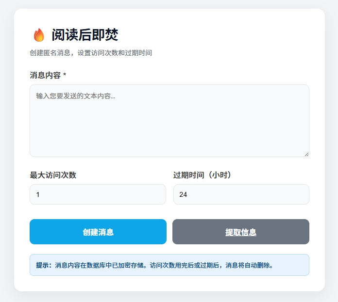

# 阅读后即焚（PHP） · BurnAfterRead

匿名创建一次性消息，支持访问次数与过期时间，数据加密存储，便捷分享。

## 界面预览

## 快速开始

- 部署到支持 PHP 的环境并启用 SQLite、OpenSSL
- 访问 `index.php`
- 首次运行自动生成随机数据库文件名并写入配置 `db_config.php`
- 修改 `config.php` 中 `ENCRYPTION_KEY`（生产环境必须更改）

## 主要功能

- 匿名创建消息；设置访问次数与过期时间
- AES-256-CBC 加密存储；查看后按规则自动销毁
- 一键复制访问链接与访问码；生成二维码便于分享
- 弹窗验证码、人机验证与防刷（时效、次数限制）
- 异步后台清理过期/用尽消息，保证最终一致性

## 环境要求

- PHP 7+、SQLite3、OpenSSL

## 使用

- 在首页创建消息并复制分享信息或生成二维码
- 点击“提取信息”进入 `view.php`，可输入提取码打开消息

## 安全

- 修改并保密 `ENCRYPTION_KEY`
- 随机数据库文件名持久化，避免枚举；验证码禁止缓存

License: MIT

